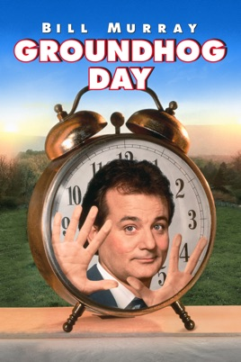
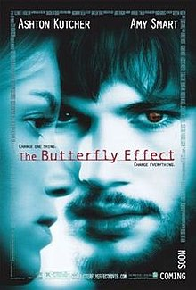

# Sampling Variation

Consider the following movies. 
Review the plot of each on popular internet sources and find what the movies have in common. 

## Groundhog Day

## The Butterfly Effect

## 50 First Dates

