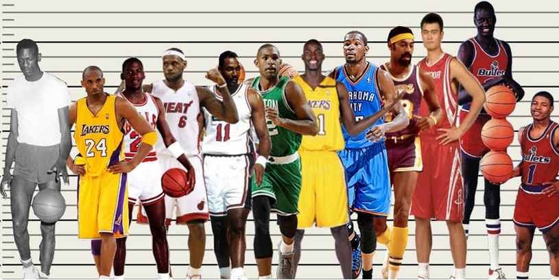

# Bias (in the Statistical Sense)

We know that the word "bias" has a particular connotation in the English language. 
Let's compare this with the same term when used in a statistical context.

## Basketball Players

What does a good basketball player look like?

In other words, can you learn, from observing someone's appearance, 
whether someone is likely to be good at playing basketball?

### Elite Basketball Players

Can you notice something that these notable basketball players have in common?

### An Advantage for Playing Basketball

Let's think about what it takes to take a free throw 
that is likely to make a basket.

It's important to shoot at an accurate angle.

A small error at the hands might make a large error at the hoop.

## The Origin of the Term "Regression"

### Regression to the Mean

The originator of the term "regression" was Sir Francis Galton (1822-1911).

He is famous for the following statement:

"When Mid-Parents are taller than mediocrity, their Children tend to be shorter than they. When Mid-Parents are shorter than mediocrity, their Children tend to be taller than they."

This quote appeared in a famous article in which the term "regression" was coined.

Francis Galton (1886). “Regression Towards Mediocrity in Hereditary Stature”. 
Journal of the Anthropological Institute 15: 246-263

### Measurement Error

Now, what Galton didn't know was that his dataset had a flaw.

Although mathematical statistics is not the focus of this course, 
it is useful to explain why "regression to the mean"
appeared to take place. 
Consider this expression for the slope coefficient
when the regression variable is measured in error.

The slope coefficient is a ratio, and measurement error
makes the denominator larger, so the ratio, as a whole will be smaller, 
in absolute magnitude.
This means that inaccurate measurement of regression variables
will push the estimated coefficient toward zero.

